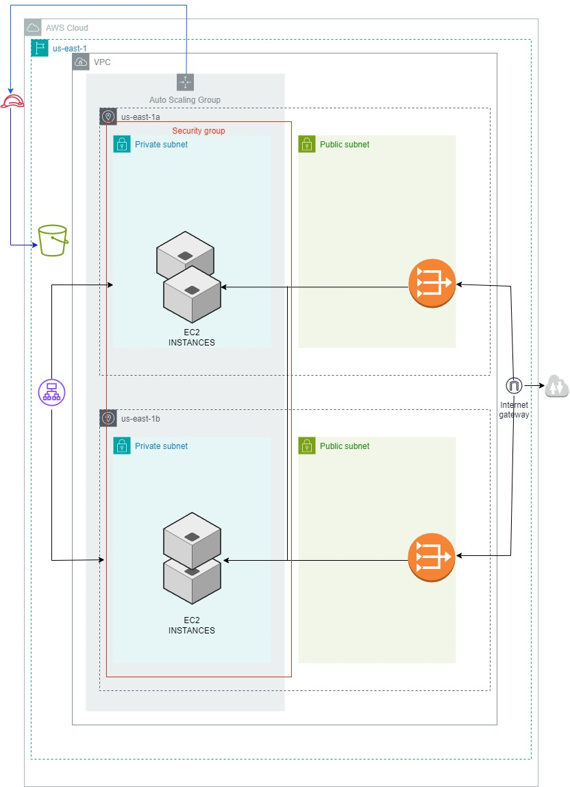

# CD12352 - Infrastructure as Code Project Solution
AURORA SANCHEZ DIAZ

This project spins up a high-availability web server (2 AZs) with CloudFormation Templates. 

The project follows this infrastructure:


## Spin up instructions

1. Create Network infrastructure by running the script inside of network folder by running this bash command:

```
./network.sh create-stack
```

2. Create Application infrastructure by running the script inside of udagram folder by running this bash command:

```
./udagram.sh create-stack
```

Once we have seen a "StackId" in the bash terminal and the stack has finished creating, we will be able to see that the project runs as expected if we click on this url:

http://udagra-LoadB-z9TKCe3fjwma-2108201856.us-east-1.elb.amazonaws.com


[!Completed](screenshot/DNSresultscreenshot.png)

## Tear down instructions

1. Delete the application infrastructure:

```
./udagram.sh delete-stack
```

2. Delete the network infrastructure:

```
./network.sh delete-stack
```

